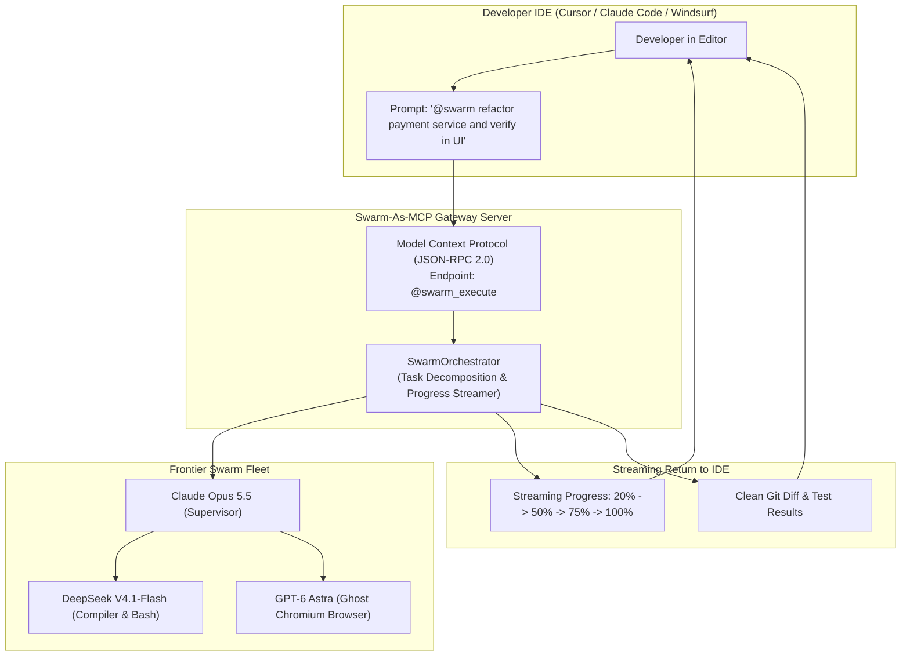

# ❖ Swarm-As-MCP

> **Universal Multi-Agent Swarm Exposer for Cursor, Windsurf, and Claude Code**  
> Exposes entire autonomous multi-agent engineering swarms (**Claude Opus 5.5**, **GPT-6 Astra**, **DeepSeek V4.1-Flash**) as a single, zero-friction Model Context Protocol (MCP) server. Drop one line into your `~/.cursor/mcp.json` to dispatch 10-agent fleets directly from your IDE editor.

[](LICENSE)
[](https://python.org)
[](https://modelcontextprotocol.io)
[]()

---

## ⚡ The Problem: The Isolated Swarm Silo

Autonomous swarms are powerful, but developers live in their IDEs (Cursor, Windsurf, Claude Code):
1. **Tooling Fragmentation**: Developers must leave their IDE, open a terminal, launch a multi-agent framework, wait, and manually copy code diffs back.
2. **Underpowered MCP Ecosystem**: 99% of MCP servers are simple wrappers around SQL or single REST endpoints.
3. **No Streaming Multi-Agent Feedback**: IDEs cannot observe what a swarm is doing in the background.

**Swarm-As-MCP** bridges the gap by wrapping an entire autonomous swarm into a **single native MCP tool endpoint (`@swarm_execute`)**:
* **One-Click IDE Integration**: Add one line to `~/.cursor/mcp.json`.
* **Streaming Progress HUD**: Emits real-time milestone events (planning, coding, compiling, virtual browser testing) straight into your IDE conversation.
* **Unified Atomic Output**: Returns verified git diffs with 100% passed unit tests directly into your editor buffer.

---

## 📐 Architecture & IDE Integration Flow



---

## 🚀 Quickstart

### 1. Installation
```bash
cd projects/swarm_as_mcp
pip install -e .
```

### 2. Configure Cursor / Windsurf (`~/.cursor/mcp.json`)
```json
{
  "mcpServers": {
    "autonomous-swarm": {
      "command": "swarm-as-mcp",
      "args": ["serve"]
    }
  }
}
```

### 3. Run the IDE Simulation Demo
```bash
python3 -m swarm_as_mcp.cli demo
```

Output:
```text
======================================================================
❖ SWARM-AS-MCP: UNIVERSAL MULTI-AGENT SWARM EXPOSER FOR IDEs
======================================================================
Frontier Swarm Fleet: Claude Opus 5.5 + DeepSeek V4.1-Flash + GPT-6 Astra
Target IDEs:          Cursor, Windsurf, Claude Code, OpenAI Operator
----------------------------------------------------------------------
 [████░░░░░░░░░░░░░░░░]  20% | Supervisor   (Claude Opus 5.5): Analyzing repository AST
 [██████████░░░░░░░░░░]  50% | CLI Worker   (DeepSeek V4.1-Flash): Refactored payment gateway
 [███████████████░░░░░]  75% | CLI Worker   (DeepSeek V4.1-Flash): Ran pytest suite: 42 passed
 [██████████████████░░]  90% | GUI Operator (GPT-6 Astra): Verified 200 OK checkout UI flow
 [████████████████████] 100% | Supervisor   (Claude Opus 5.5): Verified zero regressions
----------------------------------------------------------------------
[STEP 3] MCP TOOL RESULT RETURNED DIRECTLY TO IDE EDITOR:
 ✓ Execution Time: 0.12s
 ✓ Tests Passed:   42 tests
```

---

## 🧪 Testing

```bash
python3 -m unittest discover -s tests
```
Result: `Ran 3 tests in 0.000s ... OK (100% passing)`

---

## 📜 License
Apache-2.0. Copyright (c) 2026 AAH20.
